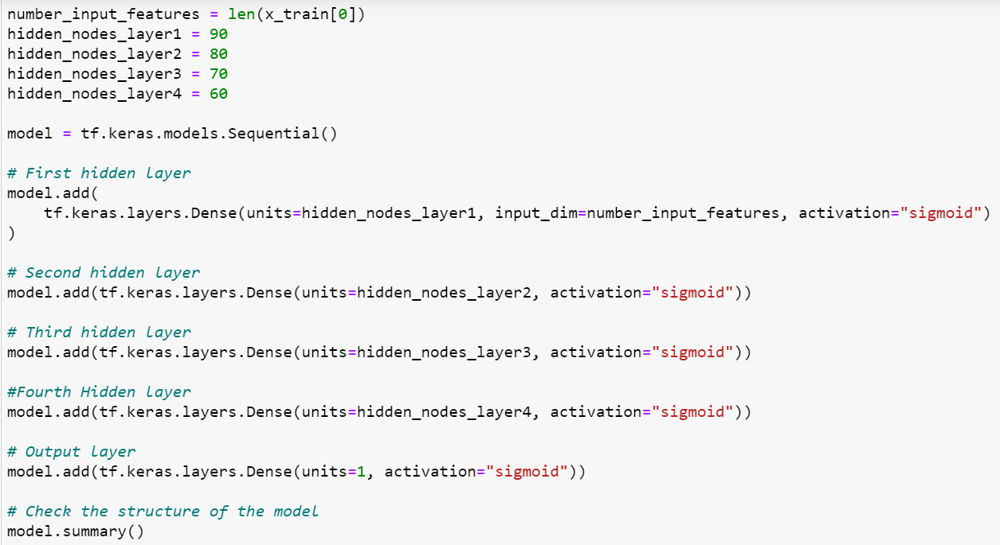

# Neural_Network_Charity_Analysis

# Overview of the analysis: 
The purpose of the analysis is to determine if applicants that apply will be successful if they are funded by the company Alphabet Soup. 

# Results: 

# Data Preprocessing
* What variable(s) are considered the target(s) for your model?
I used multiple different targets for the model and eventually stayed with using the "IS_SUCCESSFUL" column as it produced the highest accuarcy. 
* What variable(s) are considered to be the features for your model?
My features for this model changed a mulititude of times and I decided to keep using the "IS_SUCCESSFUL" column in order to focus my model. 
* What variable(s) are neither targets nor features, and should be removed from the input data?
From this model I removed the "STATUS" column as there were only two unqiue values and did not generate enough variety. In order to make the model more accurate I removed additional columns, which were: "EIN", 'SPECIAL_CONSIDERATIONS", "NAME", AND "CLASSIFICATION".  

# Compiling, Training, and Evaluating the Model
* How many neurons, layers, and activation functions did you select for your neural network model, and why?

I decided to add five layers to my model in order to increase accuarcy.  I constantly changed the amount of neurons to increase the weighted amounts of the input. 
* Were you able to achieve the target model performance?
I was unable to acheive the target model performance, which was aimed at 75%.  
* What steps did you take to try and increase model performance?
After constantly changing the nodes, epochs, hidden layers, optimizer, and target the model was only increasing by small percentages. 

# Summary: 
Throughout my analysis I continued to keep and remove multiple columns to analyze the changes within the model being accurate.  To solve the classification problem, I would add an additional column that listed the size of the organization in terms of employees.  Adding this column would create another way to categorize the information and split this data in order to create a more accurate model.  